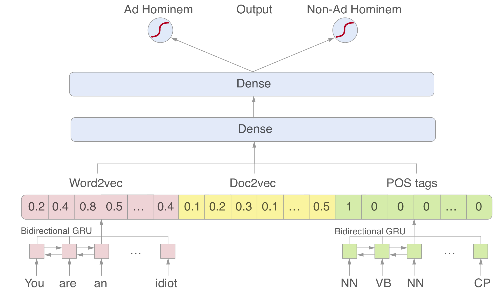
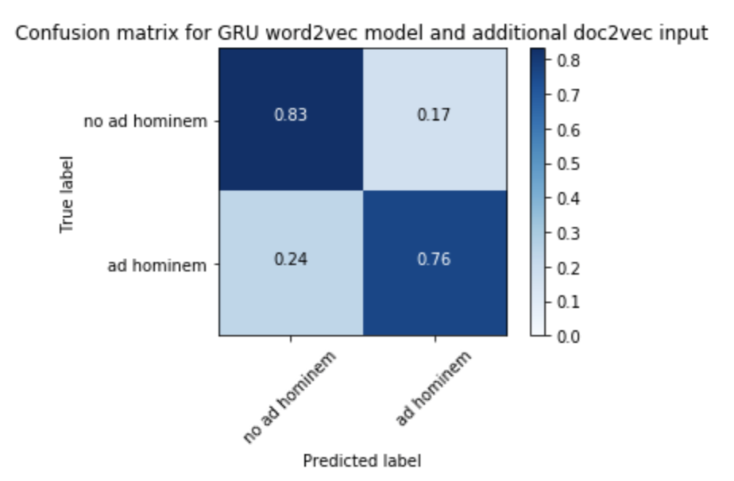

# Detecting ad hominem attacks

_This project was for the 2018-2019 course 'Knowledge and the Web' at KU Leuven._

The term "fake news" is associated with journalism that deliberately spreads deceitful or inaccurate information. In the past years, the use of the term has increased drastically, interfering in major areas within a community. The importance is such that Italian schools have implemented "fake news detection" as part of the school curriculum. In the political sphere, it is not uncommon to see allegations of fake news and misinformation. Those calls that often target sources, reporters and organizations, instead of assessing the arguments themselves. This paper will discuss the possibility to **detect fallacies**, primarily on the _ad hominem_. _Ad hominem_ literally means "to the person", and the term is used when an argument directs to the person instead of assessing the argument itself.

The datasets are sourced from [UKPLab/argotario](https://github.com/UKPLab/argotario) and [UKPLab/naacl2018-before-name-calling-habernal-et-al](https://github.com/UKPLab/naacl2018-before-name-calling-habernal-et-al).

## Classifier

During the project, **several classifiers and network architectures** were reviewed. The results are incorporated in the paper. The final, best performing network is a **bidirectional GRU** neural network, with the following features:

- [Pre-trained](https://code.google.com/archive/p/word2vec/) word embeddings ([word2vec](https://radimrehurek.com/gensim/models/word2vec.html)).
- Document embeddings.
- Part-of-speech tags ([NLTK](http://www.nltk.org/)).

These features are combined into a classification network, resulting in a labeling as _ad hominem_ or _no ad hominem_.



The network had the following confusion matrix as output, when it was trained on X and tested on 8018 paragraphs.



# Getting started with the project

## Running the backend server

This project uses [Pipenv](https://pipenv.readthedocs.io/en/latest/). So start with to create a virtual folder on your machine.

```bash
pipenv install
```

Afterwards, use:

```bash
pipenv shell
```

And if you want to exit the env, use:

```bash
exit
```

## Running the frontend

```bash
# install dependencies
npm install

# serve with hot reload at localhost:8080
npm run dev

# build for production with minification
npm run build
```

For detailed explanation on how things work, consult the [docs for vue-loader](http://vuejs.github.io/vue-loader).
